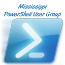

# About the Mississippi PowerShell User Group

The Mississippi PowerShell User Group (MSPSUG) is a virtual (online) user group of PowerShell enthusiasts who share the common interest of learning more about and sharing their knowledge of PowerShell. Anyone at any skill level is welcome to attend and since our meetings are virtual, anyone from anywhere can attend!

- Meeting Times: The second and fourth Tuesdays of each month at 7:30pm Mountain Time
- Location: Online via BlueJeans. See our [attendee info](https://mspsug.com/attendee-info/) page for system requirements.
- Twitter: [@MSPSUG](https://twitter.com/MSPSUG)
- Contact: Run the following in PowerShell (to prevent spam bots from discovering it)

`[System.Text.Encoding]::ASCII.GetString((([System.Runtime.Remoting.Metadata.W3cXsd2001.SoapHexBinary]::Parse("6D737073756740676D61696C2E636F6D"))).Value)`

Our group meets on the second and fourth Tuesdays of each month online via BlueJeans.

Interested in joining or supporting the Mississippi PowerShell User Group? Leave a comment or send us an email and we will follow-up with you. It is not necessary to live in Mississippi or join our user group to attend our meetings or present a session for our user group.

